# Vault Architecture

This document outlines the architecture, data flow, and ingestion pipeline for the **Vault** project (formerly Datashare). The system is designed to ingest, process, OCR, and index documents (PDF, Images, Text) for full-text search and retrieval.

## High-Level Architecture

The system follows a micro-services or modular monolith approach, currently centered around a **Worker Service** for data ingestion.

```mermaid
graph TD
    User["User / External System"] -->|Drops File| WatchFolder["📂 Ingest Folder<br/>(/tmp/vault_ingest)"]
    
    subgraph "Vault System"
        Worker["⚙️ Vault.Tasks<br/>(Worker Service)"]
        DB[("🗄 PostgreSQL<br/>(Metadata Store)")]
        ES[("🔍 Elasticsearch<br/>(Search Index)")]
    end

    WatchFolder -->|File Event| Worker
    Worker -->|Read/Move| Storage["📂 File Storage<br/>(Desktop/Vault_files)"]
    Worker -->|Store Metadata| DB
    Worker -->|Index Content| ES
```

## Components

| Component | Path | Responsibility | Keys Tech |
| :--- | :--- | :--- | :--- |
| **Vault.Tasks** | `Vault/Vault.Tasks` | Background worker that monitors files, orchestrates OCR, NLP, and handles ingestion. | .NET 9, Tesseract, PdfPig, Catalyst NLP |
| **Vault.Core** | `Vault/Vault.Core` | Shared domain models and interfaces. | .NET Standard |
| **Vault.Db** | `Vault/Vault.Db` | Database persistence layer (EF Core). | Npgsql, EF Core |
| **Vault.Index** | `Vault/Vault.Index` | Search indexing services. | Elastic.Clients.Elasticsearch |

## Ingestion Pipeline

The ingestion pipeline is implemented in `Worker.cs` and triggers automatically when a file is dropped into the watch folder.

### Key Considerations

1.  **Deduplication**: Files are hashed (SHA256) before processing. If a file with the same hash exists in storage, the new file is deleted/skipped.
2.  **OCR Strategy**:
    *   **PDFs**: First attempts to extract embedded text. If the text length is < 50 characters (implying a scanned PDF), it falls back to OCR using Tesseract.
    *   **Images**: Always processed via Tesseract.
    *   **Optimization**: Images are resized (max 2500px width), converted to grayscale, and contrast-enhanced (1.2f) before OCR to improve accuracy.
3.  **Concurrency**: The worker processes files sequentially as they are detected by the `FileSystemWatcher`.
4.  **Storage**: Processed files are moved from `/tmp/vault_ingest` to `~/Desktop/Vault_files`.

## Data Model

The core entity is the `Document`.

*   **Id**: Unique GUID.
*   **Content**: Full text content (extracted or OCR'd).
*   **Checksum**: SHA256 hash for deduplication.
*   **PageNumber**: For PDFs, each page is stored as a separate `Document` entry, allowing granular search results.

## Technology Stack

*   **Framework**: .NET 9 (Worker Service)
*   **Database**: PostgreSQL
*   **Search**: Elasticsearch
*   **Libraries**:
    *   `Tesseract` (OCR)
    *   `UglyToad.PdfPig` (PDF Parsing)
    *   `Catalyst` (NLP / Entity Recognition)
    *   `SixLabors.ImageSharp` (Image Processing)
    *   `Microsoft.EntityFrameworkCore`
